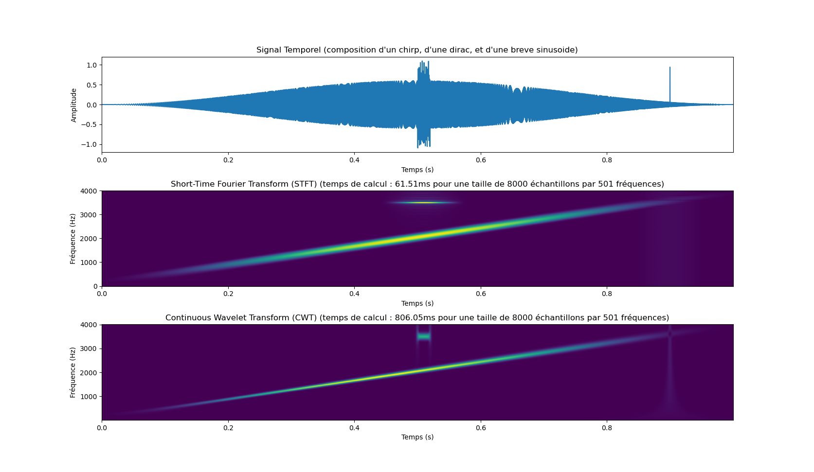

# Quelle taille pour une FFT ?

Dans le cadre de mon projet logiciel d'analyse de signaux accoustiques
[ATSAHSNA](https://github.com/simonArchipoff/ATSAHSNA), j'ai été
conduit à m'intéresser aux [transformée en ondelette
continues(CWT)](https://fr.wikipedia.org/wiki/Ondelette).

Lorsque l'on analyse un signal, on le fait usuellement dans deux
domaine : temporel et fréquentiel. La première donne naturellement des
informations sur la manière dont le signal varie dans le temps, la
seconde sur son contenu fréquentiel. Cependant, extraire des
informations est peu aisé dans le cas du temporel, et quasiment
impossible dans le cas du fréquentiel.

Pour cette raison, des outils ont été développés afin d'étudier
l'évolution du contenu fréquentiel dans le temps.

Comme nous allons le voir, l'optimisation des tailles de FFT
présentent un certain enjeux dans ce cadre.


## Contexte

Bien que le résultat soit très proche de ce qu'on obtient avec une
[transformée de fourier à court
terme(STFT)](https://fr.wikipedia.org/wiki/Transform%C3%A9e_de_Fourier_%C3%A0_court_terme),
l'algorithme est très différent.



Comme nous pouvons le voir, le temps de calcul pour la transformée en
ondelette est plus de 10 fois plus longue que la STFT avec
[scipy.signal.cwt](https://docs.scipy.org/doc/scipy/reference/generated/scipy.signal.cwt.html). Je
me suis assuré qu'il utilisait bien la transformée de fourier pour la
convolution.  D'un point de vue expérience utilisateur, si 0.06
seconde est perceptible, 0.8s est très long.

Pour une carte temps/fréquence de $t$ unités de temps sur $n$ fréquences :
* La transformée de fourier à court terme nécessite $t$ transformée de fourier de taille $2\times{}n$
* La transformée en ondelette continue nécessite $2\times{}n+1$ transformée de fourier d'une taille $t$

Dans mes cas d'usage typique pour la STFT, les données de chaque
transformée de fourier tiennent dans le cache L1 d'un processeur
moderne, le temps de calcul est principalement dépendant de la
longueur de l'entrée.  Par exemple pour un enregistrement audio à
48000 échantillons par seconde, avec $n = 2048$ on couvre le spectre
audible.  Bref, on peut considérer $n$ comme constant et le temps de
calcul d'une STFT linéaire avec $t$.

À l'inverse, pour la CWT c'est la taille des transformées de fourier
qui dépendent de $t$. Hors le temps d'exécution d'une transformée de
fourier ne croit pas linéairement avec la taille de son entrée, celui
ci est très dépendant de la décomposition en facteur premier de la
taille de l'entrée. Ce petit exemple illustré est biaisé en faveur du
STFT, j'ai choisi les paramètres pour qu'il produise une sortie de la
même taille que la transformée en ondelette. Dans un cas réel, sa
taille serait bien inférieure. Pour les paramètres, c'est un signal à
8kHz de la STFT : fenêtres de Hann de taille 1024 par incrément de 1
seulement. Pour la cwt les fréquences sont héritées de la stft, la
longueur est imposée par l'entrée, et l'ondelette et celle de morlet
avec le paramètre de nombre de cycle de $40$, ce qui est assez
élevé. Ce parametre permet l'arbitrage sur la résolution entre la
fréquence et la position. Plus l'ondelette est longue, plus elle
sélectionne sa propre fréquence, moins elle la localise précisément,
et réciproquement. J'ai choisi ce parametre pour faire converger le
résultat avec la STFT, qui a une très bonne résolution fréquentielle,
et une très mauvaise résolution temporelle.

Paradoxalement augmenter la taille de l'entrée est un moyen d'accélérer ce calcul.

## Optimiser la taille

Une très bonne heuristique est « prendre la puissance de deux suivante »,
cela conduit parfois à littéralement doubler la taille de l'entrée, donc multiplier par plus de deux le temps de calcul,
mais cela met à l'abri de faire exploser ce temps de calcul (multiplié par 10).

Nous avons un arbitrage à faire entre limiter la taille des données et préserver une « belle » factorisation de cette taille.

Mon but est très pragmatique, avoir une méthode rapide et simple pour
améliorer cette heuristique.  Je me propose de mesurer des temps
d'exécutions de transformées de fourier, de regarder les valeurs qui
se comportent bien et d'en déduire une meilleure heuristique que la
puissance de 2 suivante.

J'ai réalisé ce benchmark avec fftw3 3.3.10 avec g++ -O3 en version 13.2.1 sur un AMD Ryzen 5 5600G.


En abscisse la taille de l'entrée, en ordonnée le temps de calcul pour une FFT.

* La courbe verte représente le temps pour une entrée donnée avec la stratégie "prendre la puissance de 2 supérieure.
* La courbe bleu représente le temps si l'on prend une taille supérieure qui minimise le temps de calcul.
* La courbe rouge est donnée à titre indicatif, c'est en quelque sorte la duale de la courbe bleu, elle représente les pire choix en matière se tailles.
* La courbe rose est également donnée à titre indicatif, il s'agit de la moyenne glissante sur toute les tailles. On peut voir que les cas les pires sont suffisament graves pour affecter significativement la moyenne.

Comme nous pouvons le voir, la stratégie verte n'est pas mal, mais
sous optimale. Si nous observons les factorisation des points de la
courbe bleu, nous remarquons que l'on trouve des facteurs jusqu'à 7 et
pas au delà, en petit nombre, ainsi que des facteurs 5 et 3, même si
les facteurs 2 sont toujours majoritaires. Pas de facteur de 7 sans
facteur 5 pour les tailles significatives ?

[données factorisation valeur minimale](min_factor.md)

Je me propose donc de tester l'heuristique suivante, qui pourrait être
bien plus raffinée et rapide, peut être via des réécriture de
facteurs. L'idée est d'avoir un maximum de facteur 2, quelques
facteurs 3, et éventuellement des facteurs 5 et 7.


```c
bool good_factorisation(int n){
  int n2 = 0;
  while(n % 2 == 0){ n /= 2; n2++;} //n'importe quel nombre de facteur 2
  while(n2 > 0 && n % 3 == 0){ n/=3; n2-=3;} // moins de facteurs 3
  if(n2 > 0 && n % 5 == 0){ n/=5; n2-=3;} //éventuellement un premier facteur 5
  if(n2 > 0 && n % 5 == 0){               //un second facteur 5 ?
	n/=5; n2-=3;
	if(n2 > 0 && n % 7 == 0){ n/=7; n2-=3;} // un facteur 7 seulement s'il y a un facteur 5, cf section « Étrangeté »
  }
  return n2 >= 0 && n == 1;
}

```

Voilà ce que cela donne sur les entiers satisfaisant ce prédicat.


La surcharge de calcul engendrée par la recherche de ces tailles, bien
que très sous optimal, je l'ai mesuré à $1\text{ns}$ par exécution en moyenne
entre 2 et $2^{30}$. 


## Étrangeté

J'ai été surpris de ne pas voir systématiquement les puissances de
deux dans les minimums. C'est à dire qu'il arrive que les points verts
soient strictement au dessus de la courbe bleu. Dans un premier temps
j'ai mis ça sur le compte de bruit de mesure, après avoir fait en
sorte d'absorber ce bruit dans des mesures multiples je retrouve les
mêmes différences.

| taille puissance de 2 | durée en $\mu\text{s}$ || taille optimal |  durée $\mu\text{s}$ | factorisation |
|-------:|--------------:|-|-------------:|---------------------------:|:-------------------------------------|
|   4096 |          8.602 ||         4480 |                       7.548 | [2, 2, 2, 2, 2, 2, 2, 5, 7]          |
|  16384 |         39.552 ||        16800 |                      38.739 | [2, 2, 2, 2, 2, 3, 5, 5, 7]          |
|  32768 |        104.760 ||        33600 |                      82.358 | [2, 2, 2, 2, 2, 2, 3, 5, 5, 7]       |
|  65536 |        194.448 ||        67200 |                     176.851 | [2, 2, 2, 2, 2, 2, 2, 3, 5, 5, 7]    |
| 131072 |        440.636 ||       134400 |                     419.057 | [2, 2, 2, 2, 2, 2, 2, 2, 3, 5, 5, 7] |

Il semble que parfois les facteurs 5 et 7 soient encore meilleurs que
les facteurs 2. Je connais mal les algorithmes FFT, cela mériterait d'être
investigué  davantage.


## Conclusion et perspective

On peut faire mieux que simplement prendre la puissance de 2
supérieure, on peut même se demander si prendre une puissance de 2 est
toujours la bonne stratégie.  Dans les temps qui viennent je vais
poursuivre mon exploration des FFT, CWT et STFT et je posterais les
résultats de mes optimisations.


## Matériel

En vrac, voilà  quelques scripts pour générer et analyser les données.

* [cwt et stft](./stft_cwt.py)
* [benchmark fftw](./compare_sizes.cpp)
* [benchmark fftw (une seule taille, pour des données plus précises pour la section "étrangeté")](./compare_size.cpp)
* [analyse et tracage des courbes](./compare_size.py)

N'hésitez pas à me contacter si vous avez questions, suggestions, ou si j'ai fait une erreur.
